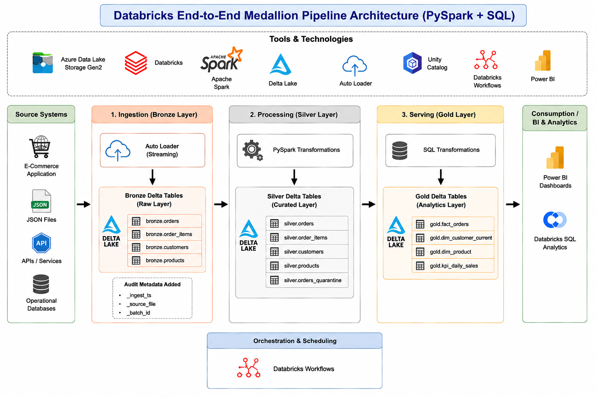
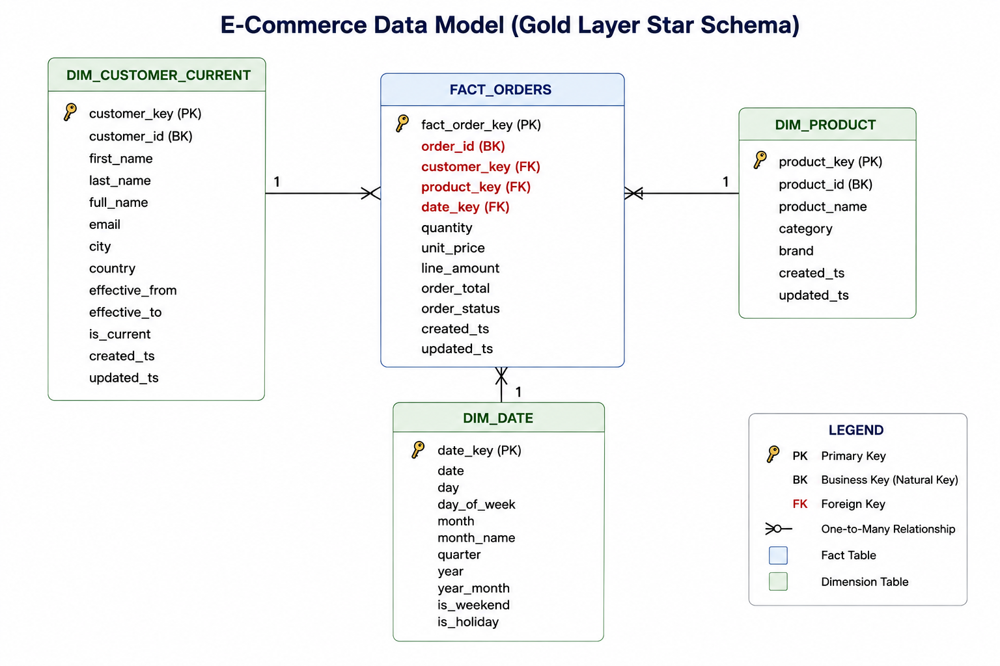

# Ecommerce-Data-Engineering-Project

## Introduction

This project demonstrates an end-to-end data engineering pipeline built on Databricks using PySpark, Delta Lake, and Spark SQL. The pipeline ingests raw e-commerce data from cloud storage, processes it through the Bronze, Silver, and Gold layers of the Medallion Architecture, and produces analytics-ready fact and dimension tables.

The pipeline incorporates schema evolution, data standardization, deduplication, incremental upserts using Delta MERGE, audit logging, partitioning to build scalable datasets for analytics and reporting.

## Architecture

## Technologies Used

- **Programming Languages:** Python, SQL
- **Data Processing:** Apache Spark (PySpark, Spark SQL)
- **Data Storage:** Delta Lake, Azure Data Lake Storage Gen2 (ADLS Gen2)
- **Databricks:** Databricks, Auto Loader (cloudFiles), Unity Catalog, Databricks Workflows
- **Version Control:** Git, GitHub

## Databricks End-to-End Medallion Pipeline (PySpark + SQL)

- **Bronze**: Raw ingestion from cloud object storage with schema evolution and audit metadata.
- **Silver**: Business-ready conformance, deduplication, quarantining, and type-safe transformations.
- **Gold**: Curated marts for analytics/BI with dimensional and KPI-ready fact tables.

## Data 

- `orders (Fact)`
- `order_items (Dim)`
- `customers (Dim)`
- `products (Dim)`

## Data Model

## Layer Design

### Bronze Layer

- Streaming ingestion from Auto Loader (`cloudFiles`) into Delta.
- Adds technical metadata (`_ingest_ts`, `_source_file`, `_batch_id`).
- Supports schema drift with schema location checkpointing.
- Stores in `catalog.bronze.*`.

### Silver Layer

- Standardization (naming, types, null handling, currency precision).
- Late-arriving handling using watermark.
- Deduplication by business keys and event timestamp.
- Delta MERGE for idempotent upserts.
- Optional SCD Type 2 for customers.
- Quarantining for rejected records in the Silver layer.
- Stores in `catalog.silver.*`.

### Gold Layer

- Star-schema style outputs:
  - `gold.fact_orders`
  - `gold.dim_customer_current`
  - `gold.dim_product`
  - `gold.kpi_daily_sales`
- SQL transformations for BI/semantic model compatibility.

## Execution Order (Databricks Workflows)

1. `01_bronze_ingestion.py`
2. `02_silver_transformations.py`
3. `03_gold_aggregations.sql`

## Runtime Requirements

- Databricks Runtime 13.3+ (or newer) with Delta Lake.
- Unity Catalog enabled (recommended).
- ADLS Gen2
- Python 3.10+

## Parameterization

All jobs use widgets and/or configuration file values:

- `catalog_name`
- `bronze_schema`
- `silver_schema`
- `gold_schema`
- `source_base_path`
- `checkpoint_base_path`
- `schema_base_path`

## Features

- Idempotent MERGE patterns.
- Watermarking and dedupe windows.
- CDC-ready merge logic pattern.
- Explicit column-level casting.
- Rejected-record sink for invalid source records.
- Audit columns (`created_ts`, `updated_ts`, `pipeline_run_id`).
- Partition strategy on high-volume facts (`order_date`).
